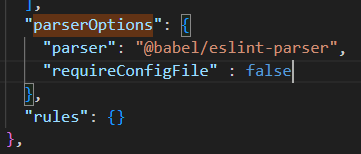

# 项目概要

## 项目结构

1. Vue 前台项目

   - Vue 前台项目，尚品汇电商平台，类似于京东电商类项目

2. Vue 后台管理系统
   - Vue 后台项目，后台管理系统，市场当中比较火热项目之一
3. 数据可视化
   - 数据可视化技术 ECharts、Canvas、SVG 等

## Vue 前台项目

### 技术架构

Vue+Webpack+VueX+Vue-router+Axios+Less

### 功能概要

- 封装通用组件
- 登陆注册
- token
- 守卫
- 购物车
- 支付
- 性能优化

## Vue 后台项目

### 技术架构

Vue+Webpack+VueX+Vue-router+Axios+SCSS+ElementUI

### 功能概要

- ElementUI
- 菜单权限
- 按钮权限
- 数据可视化

## 数据可视化

- ECharts 数据可视化开源库
- Canvas 画布
- SVG 矢量图

## 项目配置

1. 解决 App.vue 文件下的报错，package.json 文件，禁用对 Babel 配置文件的检查（前提是没有使用 Babel 进行代码转换）
   - 
2. - 在 package.json 文件中配置
   - `"eslintConfig": {"parserOptions": {}}`中
   - 添加`"requireConfigFile" : false`
3. 项目运行起来的时候，浏览器自动打开
   - package.json 文件`"scripts":{"serve":"vue-cli-service serve --open"}`
4. eslint 校验功能关闭
   - 因为它声明了的变量如果没使用就会报 error 错误
   - 在 vue.config.js 文件中配置
   - `module.exports = {}`表示对外暴露的是一个对象
   - 添加`lintOnSave : false`就关闭了校验功能
   - 键值对的形式，是冒号！
5. 给 src 文件夹取一个别名/简称为@

```js
{
   "compilerOptions":{
      "baseUrl":"./",
      "paths":{
         "@/*":["src/*"]
      }
   },
   "exclude":["node_modules","dist"]
}
```

## 项目路由分析

1. 前端路由-vue-router
   - 理解为键值对？
     - key 为 URL，地址栏中的路径
     - value 为相应的路由组件
2. 尚品汇项目上中下结构如何拆分路由？
   - 中间路由组件分为：主页路由组件 home 、搜索路由组件 search、登录路由组件 login、注册路由组件 register
   - 上下结构为非路由组件：头部和底部 header 和 footer（login、register 没有）；非路由组件被路由组件所共用

## 开始实现

### 非路由组件创建（footer、header）

0. 基于静态页面，项目的实现不关注 html+css，关注项目业务与逻辑
1. 创建非路由组件组件流程(以 header 为例)
   1. components 文件夹下创建两个文件夹 Footer、Header，并创建 index.vue 文件
      - 创建组件时，要确定组件结构+组件样式+图片资源
   2. 把静态页面的结构放好
      - 把静态页面里面的 html 结构*代码复制*，放到上述 index.vue 的 template 标签中
   3. 把静态页面的样式放好
      - 因为本项目采用 less 构建样式，安装 less、less-loader 才能被浏览器识别
        - less-loader 版本过高会报错
        - 直接指定版本号`[c]npm install --save less less-loader@5`
        - `npm uninstall -g less-loader`卸载
        - 让组件识别 less 样式，需要设定 style 属性为 lang = less
      1. less 样式*代码复制*，放到上述 index.vue 的 style 标签中
         1. 将组件引入到 App.vue 文件中
            - 引入：import 导入组件`import Header from './components/Header'`
            - 注册：export 指定 components`export default {name:,components:{}}`
            - 使用：组件名称创建标签`<Header></Header>`写在 template 中
         2. 将组件中用到的静态资源放到组件文件夹下，如 Header/images/logo.png
      2. 将通用样式的 reset.css*文件复制*，放到 public 中
         - 将 reset.css 文件 link 引入到 public/index.html 中
2. 简易流程
   - 创建或者定义组件
   - App.vue 中
     - 引入
     - 注册
     - 使用
3. 【eslint 使用问题】操作过程中发现 eslint 校验没有被关闭？
   - 如提示 `Component name "Header" should always be multi-word.eslint`
   - Header/index.vue 文件中 script 的 export default 部分
   - gpt 回答：
     - 确保 vue.config.js 文件在项目根目录下
     - 删除 node_modules 文件夹，重新 npm install 进行安装
     - 如果你的项目中使用了其他 lint 工具，例如 ESLint 或 Prettier，它们可能会覆盖或修改 lintOnSave 配置。请检查其他配置文件，如 .eslintrc.js 或 .prettierrc.js，确保没有与 lintOnSave 冲突的配置。
   - 可以是给代码添加`// eslint-disable-next-line no-unused-vars`，指定对下一行禁用 eslint
   - 可以关闭 eslint 插件
   - 可以在 eslint 配置文件中修改，设置`rules: {"no-unused-vars": "off",},`
4. 【eslint 使用问题】eslint 如何配置？
   - 保存会自动添加上分号怎么消除？
   - 发现是 prettier 插件的问题，设置取消勾选 semicolo 即可

### 路由组件创建（home、search、login、register）

0. 路由组件的创建不同于非路由组件，需要 vue-router 插件
   - 安装命令`npm install --save vue-router`
1. 路由组件与非路由组件创建的区别
   - components 文件夹：非路由组件——全局公用组件
   - 命名为 pages 或 views 文件夹：路由组件
     - 在路由组件文件夹下同样是创建 index.vue 文件
   - 同样是在 src 文件夹下，同样组件都是以文件夹的形式
2. 项目路由配置文件
   - 路由组件除了组件放在 pages 文件夹以外，还要配置项目路由，命名为 router 文件夹，和 components 和 pages 文件夹同级
   - 创建 index.js 文件在 router 文件夹中
   - 项目配置文件内容
     1. 引入 vue`import Vue from 'vue'`
     2. 引入 vue-router`import VueRouter from 'vue-router' `
     3. 使用插件`Vue.use(VueRouter)`
     4. 引入路由组件`import Home from '@/pages/Home'等`
     5. 配置路由
        ```js
        export default new VueRouter({
          routes: [
            {
              path: "/home",
              component: Home,
            },
            {
              // 类似
            },
          ],
        })
        ```
        - 这里的都属于一级路由？
     6. 在 main.js 入口文件注册
        - 引入路由
          - `import router from "@/router"`
        - 注册路由
          - Vue 实例里面写`router,`
        - 原来有的
          - 引入 vue
            - `import Vue from "vue"`
          - 引入 app.vue
            - `import App from "./App.vue"`
          - Vue 实例里面 render 渲染页面，并挂载到 id 为 app 的元素上
            ```js
            new Vue({
              render: (h) => h(App),
              router,
            }).$mount("#app")
            ```
     7. 路由组件出口
        - 在 App.vue 文件的 template 标签中添加 rooter-view 标签
3. 路由组件一切完毕，出现报错 export 'default' (imported as 'VueRouter') was not found in 'vue-router'
   1. 问题及其解答
      - vue 和 vue-router 版本不兼容问题
      - vue2 搭配 vue-router3
      - vue3 搭配 vue-router4
      - 重新安装 vue-router3 解决
      - `npm uninstall vue-router`
      - `npm install vue-router@3`
   2. 路由组件项目配置完毕，便可通过直接在网页添加路由？进行跳转
4. 路由组件和非路由组件的区别
   1. 放置位置不同
   2. 使用方式不同
      - 路由组件需要在 router 文件夹中进行注册，使用的是组件的名字；非路由组件以标签的形式使用。
      - 路由组件在 main.js 入口文件中注册 router
5. 路由组件和非路由组件的相同点
   1. 注册完，组件身上都拥有了$route和$router 属性
      - $route 是获取路由信息，有path、query 、 params、fullPath 和 meta 属性，非路由组件上也有$route
      - $router 是一般进行编程式导航
6. 进行路由重定向
   - 要在项目跑起来的时候，访问/，立马定向到首页
   - 路由配置都是在 router 文件夹下的 index.js 文件中配置
   ```js
   {
      path: "*",
      redirect: "/home",// 重定向
   },
   ```
7. 路由的跳转
   1. 声明式导航 router-link
      - 必须有 to 属性，`to="/login"`
      - 实质就是 a 标签，但是不需要 title、href 和 target 属性
   2. 编程式导航 push|replace
      - 编程式导航除了可以进行路由跳转，还有其他业务逻辑
      - 声明式导航能做的，编程式导航都能做
   3. 将 register、login、home 用声明式导航，search 用编程式导航
      - 声明式导航，将 a 标签改成 router-link 标签
        - class 保留，href、target、title 等删除
      - 编程式导航，给标签添加@click="函数名"
        - 在 script 标签的 export default 中添加 methods:{}
        - 定义函数为 `函数名(){this.$router.push('/search')}`

### 组件的显示与隐藏（footer 非路由组件可选）

1. 进入 login 和 register 路由组件的时候，footer 这个非路由组件不显示
2. 显示与隐藏？
   - v-if 是真正的操作 dom，频繁操作 dom 会导致性能下降
   - v-show 是通过样式让样式显示与隐藏
3. v-show 依据什么，boolean 值
   1. 路由信息？
      - $route.path 为 `'/home'` 或 `'/search'` 时显示
   2. 路由元信息
      - 配置 meta 字段
      - 是与 routes 配置的路由中的 path、component 同级的属性
        - home 和 search 的路由中设置`meta:{show:true}`，login 和 register 的路由中设置为 false
      - 属性名是固定的，只能有 path、query 、params、fullPath 、name 和 meta 属性
   3. 设置 v-show
      - App.vue 中设置<Footer v-show="$route.meta.show"></Footer>
4. 路由传参-路由参数，参数写法
   1. params：属于路径中的一部分，在配置路由的时候，需要占位？
   2. query 参数：不属于路径中的一部分，类似于 ajax 中的 queryString？/home?k=v&kv=，不需要占位？
5. 路由传参
   - 给 input 标签设置 v-model 为"keyword"，export default 里面
   ```js
   data(){
      return {
         keyword:''
      }
    },
   ```
   - 为什么$route 可以获取到 input 输入的值？
6. 路由传参方法
   - 在路由中配置占位 `path: "/search/:keyword`
   - 无论一下那种方法，都需要配置占位符！才能在 url 中显示 keyword
   1. 字符串形式传递
      1. params 参数
         - push 改成`this.$router.push("/search"+this.keyword)`
      2. query 参数
         - push 改成`this.$router.push("/search"+this.keyword+"?k="+this.keyword.toUpperCase())`
         - 这样传递了两个参数，params 和 query
      3. 可以获取到传入的参数
         - `$route.params.keyword`
         - `$route.query.k`
   2. 模板字符串形式传递
      ```js
      this.$router.push(
        `/search/${this.keyword}?k=${this.keyword.toUpperCase()}`
      )
      ```
   3. 对象形式传递
      - 需要在路由中配置 name 属性
        - `name:"search"`
      ```js
      this.$router.push({
        name: "search",
        params: { keyword: this.keyword },
        query: { k: this.keyword.toUpperCase() },
      })
      ```
      - 不能用 path 写法
7. 设置完了，也获取到了 params 和 query，但是网址显示不正确？没有显示 params？
   - http://localhost:8080/#/search?k=ASDFASD
   - 一直没有关注 console！
   - 因为没有在目标路由正确定义 keyword 参数！
   - `path: '/search/:keyword'`
8. 为什么 data 写成函数的形式？
   ```js
   export default {
     // eslint-disable-next-line vue/multi-word-component-names
     name: "Header",
     data() {
       return {
         keyword: "",
       }
     },
   }
   ```
9. 报错 Refused to apply style from 'http://localhost:8080/iconfont.css' because its MIME type ('text/html') is not a supported stylesheet MIME type, and strict MIME checking is enabled.
10. 路由传参相关面试题

- 路由传递参数（对象写法）path 是否可以结合 params 参数一起使用？
  - 不可以，
- 如何指定 params 参数可传可不传？
  - 对象指定的时候如果不传 params，会导致 search 消失
  - 应该通过占位的时候指定 params 可传可不传
  - `path: '/search/:keyword?'`也就是加一个问号
  - 类似于正则
- params 参数可以传递也可以不传递，但是如果传递是空串，如何解决？
  - 对象指定的时候如果 params 为空串，会导致 search 消失
  - 用 undefined 解决''||undefined
  - this.$router.push({name:"search",params:{ keyword:''||undefined} })
- 路由组件能不能传递 props 数据？
  - 可以，有三种写法（路由组件可以传递 props）
    - 布尔值写法，给路由组件传递参数 `props:true`， 路由组件本身可以接收 `props:['keyword']`（只能 params 参数）；之后路由组件身上多了一个$attrs ，有 keyword 属性
    - 对象写法，给路由组件传递对象 `props:{k:v}`，路由组件本身可以接收 `props:['k']`；之后路由组件身上多了一个$attrs ，有 k 属性
    - 函数写法，params 参数和 query 参数都通过 props 传递给路由组件`props:(route)=>{return keyword:$route.params.keyword,k:$route.query.k}`或者`props:(route)=>({keyword:$route.params.keyword,k:$route.query.k})`；之后路由组件身上多了一个$attrs ，有 k 属性，同时 props 里面有 keyword

### 问题引入：编程式路由跳转到当前路由（参数不变），多次执行会抛出 NavigationDuplicated 的警告错误

1. vue-router3.6.5 有 promise，查看 this.$route.push 的返回值，是 promise 有成功还是失败的回调，resolve 和 reject
   - 解决 1：push 参数最后添加两个回调()=>{},()=>{}或者()=>{},(e)=>{console.log(e)}
   - 解决 2：重写 push 方法
2. 明确：this 是当前组件实例，this.$router 是当前组件实例的属性值 VueRouter 类的一个实例，main.js 入口文件注册路由时给组件实例添加的 router，this.$route.push 在 this.$router 实例上没有，但是在其 VueRouter 原型对象上有
3. 其实就是要在 router 的 index.js 文件中重写 `VueRouter.prototype.push = function(){}`
   - 这里面的 this 是 VueRouter 类的实例
   - 在 router 的 index.js 文件中重写
   - 重写步骤
     1. 先保存原型里面的 push 方法 `let originPush = VueRouter.prototype.push;`
     2. 重写
        - 传参：location 跳转位置，resolve 成功回调，reject 失败回调
        - 当 resolve 和 reject 都存在时，调用 originPush 方法
          - 该方法需要通过 call/apply 方法调用，因为函数本身的 this 是 window，而我们要让上下文为 VueRouter 类实例
          - `originPush.call(this,location,resolve,reject)`
          - 引申：apply 方法和 call 方法的相同和不同点
        - 当 resolve 和 reject 都不存在时
          - `originPush.call(this,location,()=>{},()=>{})`

### 拆分 home 模块组件

1. 流程
   1. 编写静态页面 html+css
   2. 拆分静态组件——为什么要拆分组件？怎么拆分组件？怎么创建组件？
   3. 获取服务器的数据动态展示——axios
   4. 实现相应的动态业务逻辑——？
2. home 模块拆分
   1. 三级联动？home 用到了、search 用到了、商品详情页用到了
      - 全局组件：注册一次项目任意地方使用，多个模块使用
   2. 轮播图+尚品汇快报=》一个整体组件
   3. 今日推荐=》一个组件
   4. 热卖排行=》一个组件
   5. 猜你喜欢=》一个组件
   6. 家用电器=手机通讯=》复用的一个组件
   7. logo=》一个组件

## 组件实现

1. 全局组件创建流程
   1. 在 pages 中的对应模块，创建组件名文件夹，并创建 index.vue 文件
   2. 同样的注意（无论是否全局组件）：html 结构、css 样式、静态资源放到 index.vue 文件中
   3. 在 main.js 文件中注册全局组件
      1. 先引入`import TypeNav from '@/pages/Home/TypeNav`
      2. 再注册为全局组件
   4. 使用
      1. 全局组件不需要再 Home/index.vue 中引入
      2. 直接使用<TypeNav/>
      3. 为什么是单标签？为什么前面 header 等都是双标签？
2. 其余静态组件创建流程——以 ListContainer 为例
   1. html+css+静态资源
      - 静态组件下的 index.vue 不需要写 name
      ```js
      export default {
        name: "",
      }
      ```
   2. 引入
      - 在 Home/index.vue 的 script 中引入`import ListContainer from '@/pages/Home/ListContainer'`
   3. 注册
      - 在 Home/index.vue 中注册
      ```js
      export default {
        name: "", // 为什么这里不用写？
        components: {
          // 必须要s
          ListContainer,
        },
      }
      ```
   4. 使用
      - 出现报错 Errors compiling template:Component template should contain exactly one root element. If you are using v-if on multiple elements, use v-else-if to chain them instead.
      ```html
      <template>
        <TypeNav />
        <ListContainer />
      </template>
      ```
      应该改成
      ```html
      <template>
        <div>
          <TypeNav />
          <ListContainer />
        </div>
      </template>
      ```
   5. 显示问题
      - 因为是静态资源，所以轮播图在 home 的 index.vue 中暂时只显示一个！
3. 其余静态组件创建尝试
   - 出现报错：Unknown custom element: <TodayRecommend> - did you register the component correctly? For recursive components, make sure to provide the "name" option.
   - 页面只有>=`00%的时候才会显示 TodayRecommend 组件

## 接口测试

1. vue.config.js 文件，配置代理跨域，设置最新的接口地址
   ```js
   module.exports = defineConfig({
     devServer: {
       proxy: {
         "/api": {
           target: "http://gmall-h5-api.atguigu.cn",
         },
       },
     },
   })
   ```
2. 接口到底是什么？可以自己写吗？要买吗？
3. postman 工具测试接口能否使用
   - code 为 200 表示返回数据成功
   - 所有的接口都有/api 前缀

## axios 二次封装

1.  面试会要求手写原生 axios ，会问会用 axios 是不是自己重写的
2.  发请求、获取数据、展示数据
    - 发请求：XMLHttpRequest fetch JQuery Axios
    - 项目中一般选择 Axios
3.  为什么要对 Axios 进行二次封装？
    - 主要要用到 axios 的请求拦截器和响应拦截器
    - 请求拦截器：发请求之前处理业务
    - 响应拦截器：服务器返回数据之后处理业务
4.  进入到 app 目录下，安装 axios
    - `npm install --save axios`
    - 在 package.json 文件中查看是否安装成功，及其版本
5.  项目中的 api 文件夹，就是关于 axios 的
    - 在 src 文件夹下创建 api 文件夹
    - 在 api 文件夹中创建 request.js 文件
    - 在 request.js 文件中对 axios 进行封装
6.  axios 封装流程
    1. 引入 axios`import axios from "axios"`
    2. 利用 axios 对象的 create 方法，创建 axios 实例，create 方法里面传入配置对象
       - 配置基础路径`baseURL:"/api"`
       - 配置请求超时的时间`time:5000`
    3. 请求拦截器 interceptors
    ```js
    axios对象.interceptors.request.use((config) => {
      return config // 配置对象config，里面的headers请求头属性很重要
    })
    ```
    - 在请求发出之前处理业务
    4. 响应拦截器
    ```js
    axios对象.interceptors.response.use(
      (res) => {
        return res.data
      },
      (err) => {
        return Promise.reject(new Error("false"))
      }
    )
    ```
        - 直接看 git 或者 npm 的 axios 文档
    5. 对外暴露
       - `export default axios对象`
7.  对 axios 二次封装，就是引入 axios 后，创建 axios 对象，传入一定的配置项如超时时间、基础路径，设置请求拦截器和响应拦截器，再将这个 aixos 对象对外暴露

## 接口统一管理

1. 两种情形
   1. 项目小、接口少、组件少，可以直接在组件的生命周期函数中发请求
   2. 项目大，axios.get('')统一管理接口
2. api 文件夹下创建 index.js 文件，用于统一管理接口
   1. 引入二次封装的 axios
   2. 对外暴露一个箭头函数
   3. 箭头函数里面发请求，用 axios 的函数的形式，传入配置对象
      - `requests({url:'',method:'get'})`
      - 并用上述作为返回结果
      - axios 发请求返回结果是 Promise 对象
3. 使用接口
   1. 在 main.js 文件中引入
      - `import { reqCategoryList } from "@/api"`
      - 为什么不需要指定文件名？
      - 分别暴露，所以用{}
   2. 调用 index.js 中的函数
4. 解决跨域问题
   1. 协议、域名、端口号不同
   2. webpack 提供功能 DevServer，vue.config.js 文件当作是 webpack.config.js 文件，在里面配置
   ```js
   devServer: {
      proxy: {
         "/api": {
         target: "http://gmall-h5-api.atguigu.cn",
         // pathRewrite:{'^/api':''}
         },
      },
   }
   ```
   3. 解决方法：proxy、CORS、JSONP
   4. 服务器和服务器之间没有跨域问题，浏览器才有跨域问题

## nprogress 进度条插件

1. 